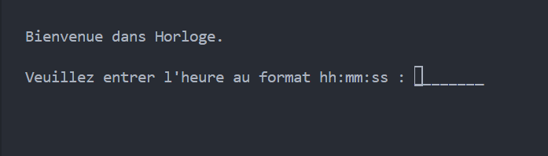

# clock

**Projet de groupe à quatre**



***
# Projet Horloge et Alarme

## Description

Ce projet est une horloge interactive avec une fonctionnalité d'alarme. Il permet d'afficher l'heure en format 12h ou 24h, de configurer une alarme, et d'interagir via des commandes textuelles.

## Fonctionnalités
- Affichage de l'heure en temps réel
- Passage entre le format 12h et 24h
- Configuration d'une alarme
- Interface en ligne de commande

## Installation
1. Clonez le dépôt :
   ```sh
   git clone https://github.com/jeremy-gavend
   git clone https://github.com/AdelinePat
   git clone https://github.com/jolyne-mangeot
   git clone https://github.com/Florence-Navet
   ```
2. Accédez au dossier du projet :
   ```sh
   cd votre_dossier_projet
   ```
3. Assurez-vous d'avoir Python installé (>=3.7)
4. Exécutez le script principal :
   ```sh
   python main.py
   ```

## Utilisation
Lancez le programme et suivez les instructions affichées. Vous pouvez entrer différentes commandes pour interagir avec l'horloge et l'alarme.

## Aperçu


## Crédits
Projet réalisé par :
- [Jeremy Gavend](https://github.com/jeremy-gavend)
- [Adeline Pat](https://github.com/AdelinePat)
- [Jolyne Mangeot](https://github.com/jolyne-mangeot)
- [Florence Navet](https://github.com/florence-navet)

## Licence
Ce projet est sous licence MIT.
